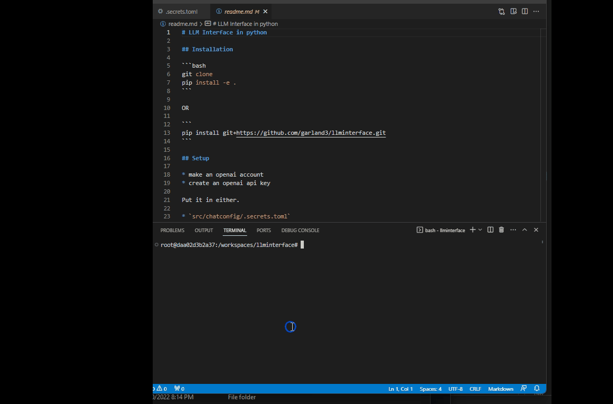

# LLM Interface in python



## Installation

```bash
git clone 
pip install -e .
```

OR

```
pip install git+https://github.com/garland3/llminterface.git
```

## Setup

* make an openai account
* create an openai api key

Put it in either.

* `src/chatconfig/.secrets.toml`
* `~/.llminterface/.secrets.toml`
* `~/.secrets.toml`

```toml
openaikey = "blahblahblah"
```

I'm using dynaconfig to load the secrets. So you could also put it in an environment variable.

```bash
export DYNACONF_openaikey="blahblahblah"
```

## Usage

See the examples folder for examples of how to use the interface.

```python
from llminterface.interface_openai import OpenAIChat
# def main():
c = OpenAIChat()
c.start_dialog()
c("Hello")

# %%
c("Given a csv file with 'temp' as a column and some other columns. Use flaml, automl to predict the temp column. Write the code. ")

# %%
c("can you write some fake data to test the code?")
```

OR in the commandline

```bash
chat Given a csv file with 'temp' as a column and some other columns. Use flaml, automl to predict the temp column. Write the code.

```

## Dev

* pre-commit with black and flake8
* testing with pytest

```bash
pytest tests -vv -s -x
```
